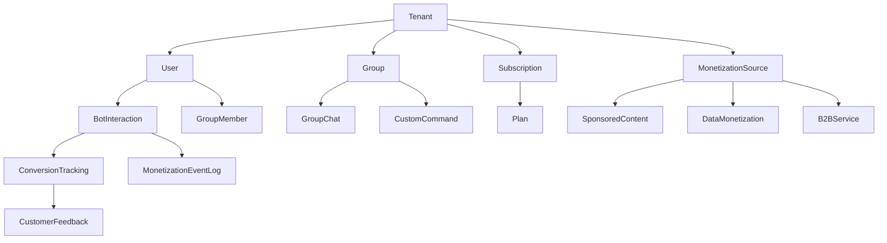

# Model Relationships and Usage Guide

## Entity Relationship Overview

This section explains the relationships between different models in the schema and how to use them effectively.

## Core Entity Relationships

### 1. Tenant (Central Entity)


### 2. User Relationships
```python
# User can belong to multiple groups
class User(BaseModel):
    id: uuid.UUID
    tenant_id: uuid.UUID
    groupme_user_id: str

    # Links to groups through GroupMember
    # Links to interactions through BotInteraction

# GroupMember provides group-specific user data
class GroupMember(BaseModel):
    id: str
    tenant_id: uuid.UUID
    group_id: str
    user_id: Optional[uuid.UUID]  # Link to User if applicable

    member_username: str
    is_paid_subscriber: bool
    engagement_score: float
```

## Usage Patterns

### 1. Creating a Complete User Journey

```python
from schemas.tenants import Tenant
from schemas.users import User, GroupMember
from schemas.groups import Group, GroupChat
from schemas.analytics import BotInteraction, ConversionTracking

# 1. Create tenant
tenant = Tenant(name="Acme Corp", api_key="abc123")

# 2. Create user
user = User(
    tenant_id=tenant.id,
    groupme_user_id="user_456",
    nickname="John Doe"
)

# 3. Create group
group = Group(
    tenant_id=tenant.id,
    groupme_group_id="group_789",
    name="Product Discussion"
)

# 4. Add user to group
group_member = GroupMember(
    tenant_id=tenant.id,
    group_id=group.id,
    user_id=user.id,
    member_username="John_Doe",
    is_paid_subscriber=False
)

# 5. Track bot interaction
interaction = BotInteraction(
    tenant_id=tenant.id,
    user_id=user.id,
    group_id=group.id,
    message_text="Show me your products",
    intent="product_inquiry",
    sentiment="positive"
)

# 6. Track conversion
conversion = ConversionTracking(
    tenant_id=tenant.id,
    interaction_id=interaction.id,
    bot_id="sales_bot_001",
    trigger_message="Show me your products",
    intent_score=0.85,
    bot_message="Here are our top products!",
    outcome="purchased",
    conversion_value=29.99,
    checkout_completed=True
)
```

### 2. Querying Related Data

```python
# Get all interactions for a tenant
def get_tenant_interactions(tenant_id: uuid.UUID):
    return db.query(BotInteractionTable).filter(
        BotInteractionTable.tenant_id == tenant_id
    ).all()

# Get conversion rate for a specific bot
def get_bot_conversion_rate(bot_id: str, tenant_id: uuid.UUID):
    conversions = db.query(ConversionTrackingTable).filter(
        ConversionTrackingTable.bot_id == bot_id,
        ConversionTrackingTable.tenant_id == tenant_id,
        ConversionTrackingTable.outcome == "purchased"
    ).count()

    total_interactions = db.query(BotInteractionTable).filter(
        BotInteractionTable.bot_id == bot_id,
        BotInteractionTable.tenant_id == tenant_id
    ).count()

    return conversions / total_interactions if total_interactions > 0 else 0

# Get user engagement across groups
def get_user_engagement(user_id: uuid.UUID, tenant_id: uuid.UUID):
    interactions = db.query(BotInteractionTable).filter(
        BotInteractionTable.user_id == user_id,
        BotInteractionTable.tenant_id == tenant_id
    ).all()

    group_members = db.query(GroupMemberTable).filter(
        GroupMemberTable.user_id == user_id,
        GroupMemberTable.tenant_id == tenant_id
    ).all()

    return {
        "total_interactions": len(interactions),
        "groups_joined": len(group_members),
        "avg_engagement_score": sum(m.engagement_score for m in group_members) / len(group_members)
    }
```

## Advanced Relationships

### 1. Monetization Attribution
```python
# Track revenue from bot interactions
def get_monetization_attribution(tenant_id: uuid.UUID, days: int = 30):
    cutoff_date = datetime.utcnow() - timedelta(days=days)

    # Get conversions with revenue
    conversions = db.query(ConversionTrackingTable).filter(
        ConversionTrackingTable.tenant_id == tenant_id,
        ConversionTrackingTable.created_at >= cutoff_date,
        ConversionTrackingTable.conversion_value > 0
    ).all()

    # Aggregate by monetization source
    attribution = defaultdict(float)

    for conversion in conversions:
        source_id = conversion.monetization_source_id
        if source_id:
            monetization_source = db.query(MonetizationSourceTable).filter(
                MonetizationSourceTable.id == source_id
            ).first()

            if monetization_source:
                attribution[monetization_source.source_name] += conversion.conversion_value

    return dict(attribution)
```

### 2. Group Analytics
```python
# Analyze group performance
def get_group_analytics(group_id: str, tenant_id: uuid.UUID):
    # Get group details
    group = db.query(GroupTable).filter(
        GroupTable.id == group_id,
        GroupTable.tenant_id == tenant_id
    ).first()

    # Get member statistics
    members = db.query(GroupMemberTable).filter(
        GroupMemberTable.group_id == group_id,
        GroupMemberTable.tenant_id == tenant_id
    ).all()

    # Get interaction statistics
    interactions = db.query(BotInteractionTable).filter(
        BotInteractionTable.group_id == group_id,
        BotInteractionTable.tenant_id == tenant_id
    ).all()

    # Get conversion statistics
    conversions = db.query(ConversionTrackingTable).filter(
        ConversionTrackingTable.group_id == group_id,
        ConversionTrackingTable.tenant_id == tenant_id
    ).all()

    return {
        "group_name": group.name if group else "Unknown",
        "member_count": len(members),
        "paid_subscribers": sum(1 for m in members if m.is_paid_subscriber),
        "total_interactions": len(interactions),
        "successful_conversions": sum(1 for c in conversions if c.outcome == "purchased"),
        "conversion_rate": len([c for c in conversions if c.outcome == "purchased"]) / len(interactions) if interactions else 0
    }
```

## Data Consistency Patterns

### 1. Cascading Updates
```python
# When a user is deleted, clean up related data
def delete_user_cascade(user_id: uuid.UUID, tenant_id: uuid.UUID):
    # Delete group memberships
    db.query(GroupMemberTable).filter(
        GroupMemberTable.user_id == user_id,
        GroupMemberTable.tenant_id == tenant_id
    ).delete()

    # Archive interactions (don't delete for analytics)
    db.query(BotInteractionTable).filter(
        BotInteractionTable.user_id == user_id,
        BotInteractionTable.tenant_id == tenant_id
    ).update({"archived": True})

    # Delete user
    db.query(UserTable).filter(
        UserTable.id == user_id,
        UserTable.tenant_id == tenant_id
    ).delete()

    db.commit()
```

### 2. Data Validation
```python
# Validate foreign key relationships
def validate_conversion_tracking(conversion: ConversionTracking):
    # Check if interaction exists
    interaction = db.query(BotInteractionTable).filter(
        BotInteractionTable.id == conversion.interaction_id,
        BotInteractionTable.tenant_id == conversion.tenant_id
    ).first()

    if not interaction:
        raise ValueError("Invalid interaction_id")

    # Check if bot exists
    bot = db.query(ChatBotTable).filter(
        ChatBotTable.id == conversion.bot_id,
        ChatBotTable.tenant_id == conversion.tenant_id
    ).first()

    if not bot:
        raise ValueError("Invalid bot_id")

    # Validate monetization source if provided
    if conversion.monetization_source_id:
        source = db.query(MonetizationSourceTable).filter(
            MonetizationSourceTable.id == conversion.monetization_source_id,
            MonetizationSourceTable.tenant_id == conversion.tenant_id
        ).first()

        if not source:
            raise ValueError("Invalid monetization_source_id")
```

## Performance Optimization

### 1. Indexing Strategy
```sql
-- Primary indexes (automatically created)
-- Composite indexes for common queries
CREATE INDEX idx_bot_interactions_tenant_timestamp
    ON bot_interactions(tenant_id, created_at DESC);

CREATE INDEX idx_conversion_tracking_tenant_outcome
    ON conversion_tracking(tenant_id, outcome, created_at DESC);

CREATE INDEX idx_group_members_tenant_group_engagement
    ON group_members(tenant_id, group_id, engagement_score DESC);
```

### 2. Query Optimization
```python
# Use joins for related data
def get_user_conversion_summary(user_id: uuid.UUID, tenant_id: uuid.UUID):
    result = db.query(
        ConversionTrackingTable.outcome,
        func.count(ConversionTrackingTable.id).label('count'),
        func.sum(ConversionTrackingTable.conversion_value).label('total_value')
    ).join(
        BotInteractionTable,
        ConversionTrackingTable.interaction_id == BotInteractionTable.id
    ).filter(
        BotInteractionTable.user_id == user_id,
        BotInteractionTable.tenant_id == tenant_id
    ).group_by(
        ConversionTrackingTable.outcome
    ).all()

    return {row.outcome: {"count": row.count, "total_value": row.total_value} for row in result}
```

## Best Practices

### 1. Consistent Field Naming
- Use `tenant_id` for all multi-tenant relationships
- Use `created_at` and `updated_at` timestamps consistently
- Use descriptive field names that match business logic

### 2. Validation Rules
```python
# Pydantic validators for complex relationships
class ConversionTracking(BaseModel):
    # ... fields ...

    @validator('outcome')
    def validate_outcome(cls, v):
        valid_outcomes = ["purchased", "visited", "did_nothing", "abandoned"]
        if v not in valid_outcomes:
            raise ValueError(f"Invalid outcome. Must be one of: {valid_outcomes}")
        return v

    @validator('conversion_value')
    def validate_conversion_value(cls, v):
        if v is not None and v < 0:
            raise ValueError("Conversion value cannot be negative")
        return v
```

### 3. Error Handling
```python
# Handle relationship errors gracefully
def safe_get_conversion(interaction_id: str, tenant_id: uuid.UUID):
    try:
        return db.query(ConversionTrackingTable).filter(
            ConversionTrackingTable.interaction_id == interaction_id,
            ConversionTrackingTable.tenant_id == tenant_id
        ).first()
    except Exception as e:
        logger.error(f"Error retrieving conversion for {interaction_id}: {e}")
        return None
```

## Next Steps

- [Analytics and Optimization](./04_analytics_and_optimization.md) - Performance tracking and improvement
- [Monetization Strategies](./05_monetization_strategies.md) - Revenue optimization techniques
- [Best Practices](./06_best_practices.md) - Implementation guidelines
